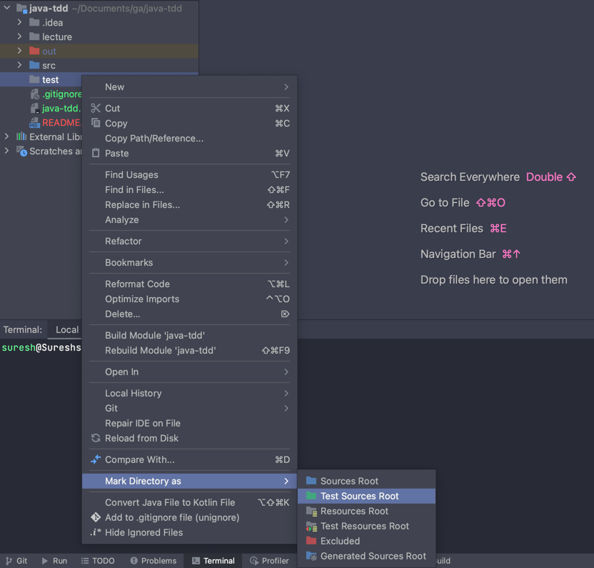
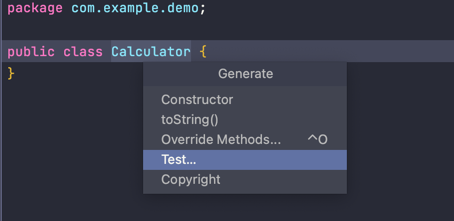
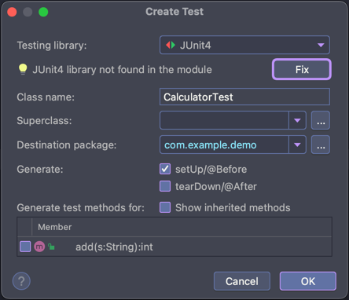
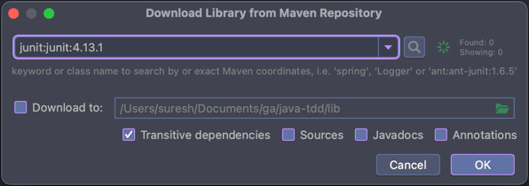

# 

**Learning objective:** By the end of this lesson, students will be able to create a unit test to employ Test-Driven Development to create a simple Calculator class. 

### Creating a Unit Test

Create `test` directory in the `java-tdd/` root directory.

Mark the directory as `Test Sources Root`.

Open `Calculator` class, and place the caret somewhere inside the curly braces in the class, `press ⌘ N`.

Select Test Method from the menu. This will create a test method from the default template.

Select `JUnit4` dependency by clicking the `Fix` button.

.

Finally, close the Download Library from Maven Repository dialog box by pressing OK button.

In the package `com.example.demo`, be sure to check whether the `CalculatorTest` class exists.

### Phase 1 (requirement definition)

We will take a simple example of a calculator application, and we will define the requirements based on the basic
features of a calculator. So as said earlier TDD starts with defining requirements in terms of tests. Let's refine our
first requirement in terms of tests.

- Create a simple String calculator with a method `int add(string numbers)`
- The method can take 0, 1 or 2 numbers, and will return their sum (for an empty string it will return `0`) for
  example `“”` or `1` or `1,2`
- Allow the `add` method to handle an unknown amount of numbers
- Allow the `add` method to handle new lines between numbers (instead of commas).
- The following input is ok: `1\n2,3` (will equal 6)
- Support different delimiters
- To change a delimiter, the beginning of the string will contain a separate line that looks like this: `//[delimiter]
  \n[numbers…]` for example `//;\n1;2` should return three where the default delimiter is `;`
- The first line is optional. All existing scenarios should still be supported
- Calling `add` with a negative number will throw an exception `negatives not allowed` – and the negative that was
  passed. If there are multiple negatives, show all of them in the exception message stop here if you are a beginner.
- Numbers bigger than `1000` should be ignored, so adding `2 + 1001` = 2

Even though this is a very simple program, just looking at those requirements can be overwhelming. Let’s take a
different approach. Forget what you just read and let us go through the requirements one by one.